# Vue-Vuetify-for-Java-Spring-Boot-MongoDB
# Artesanía Viva — Frontend
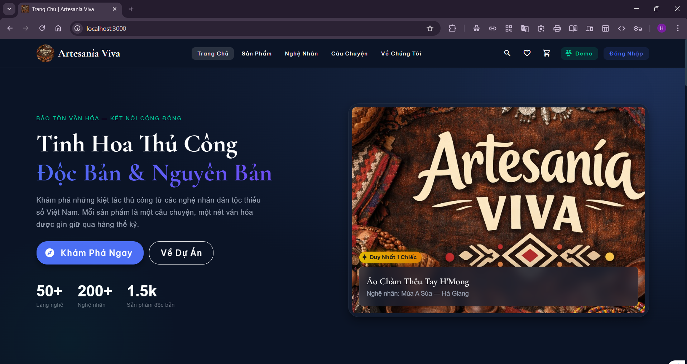 
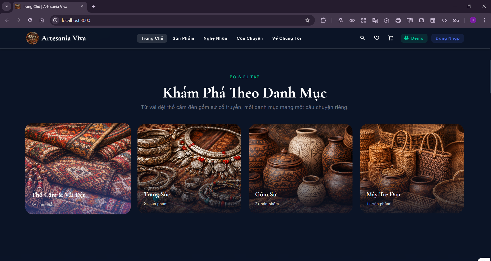 
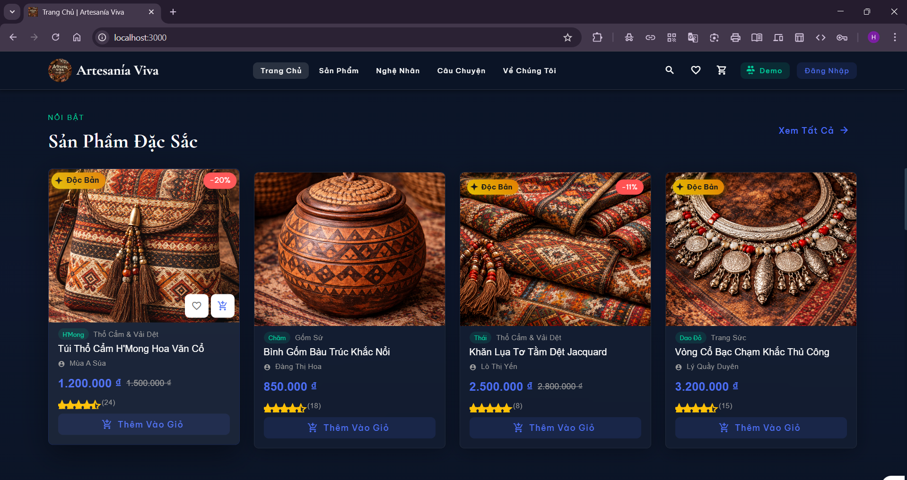 
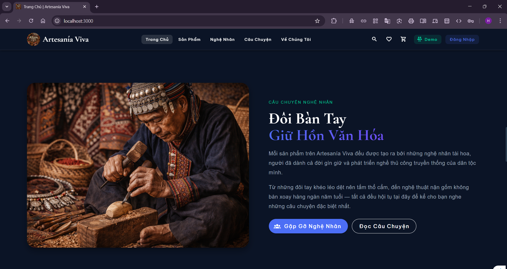 
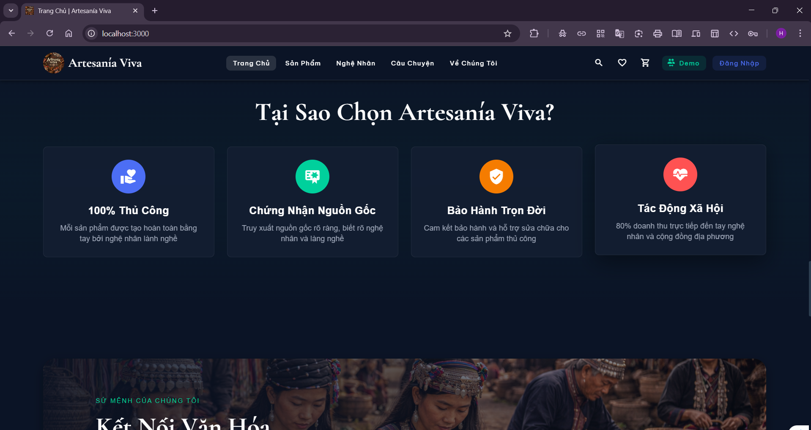 
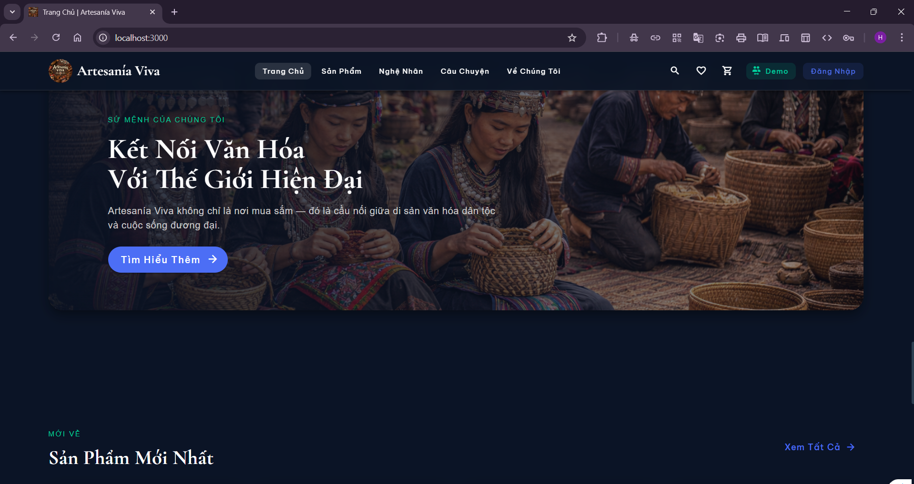 
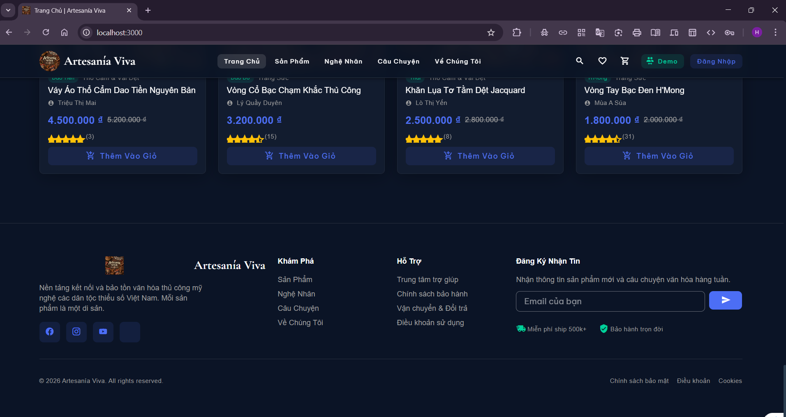 
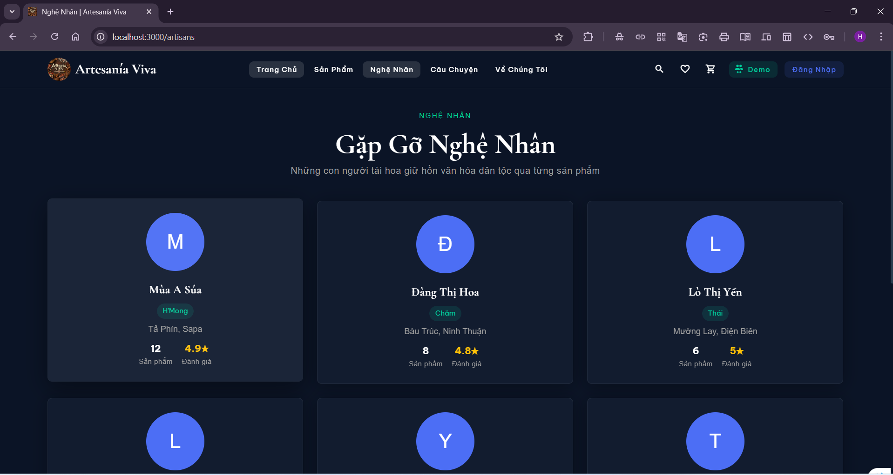 
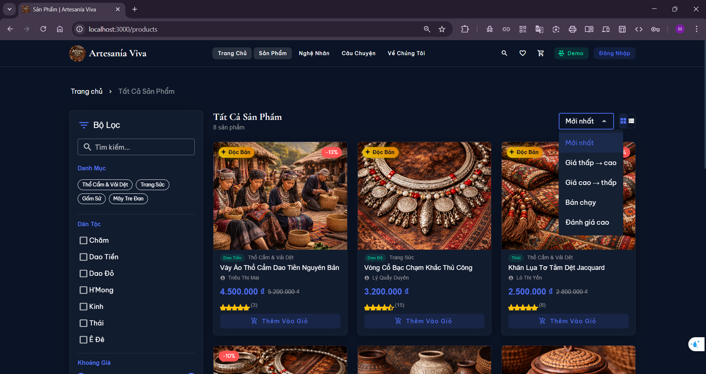 
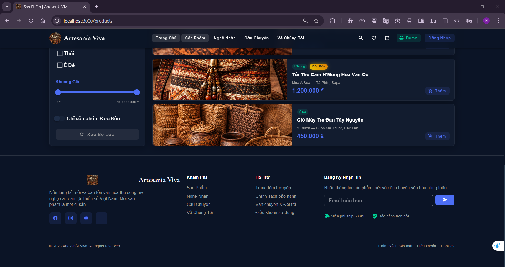 
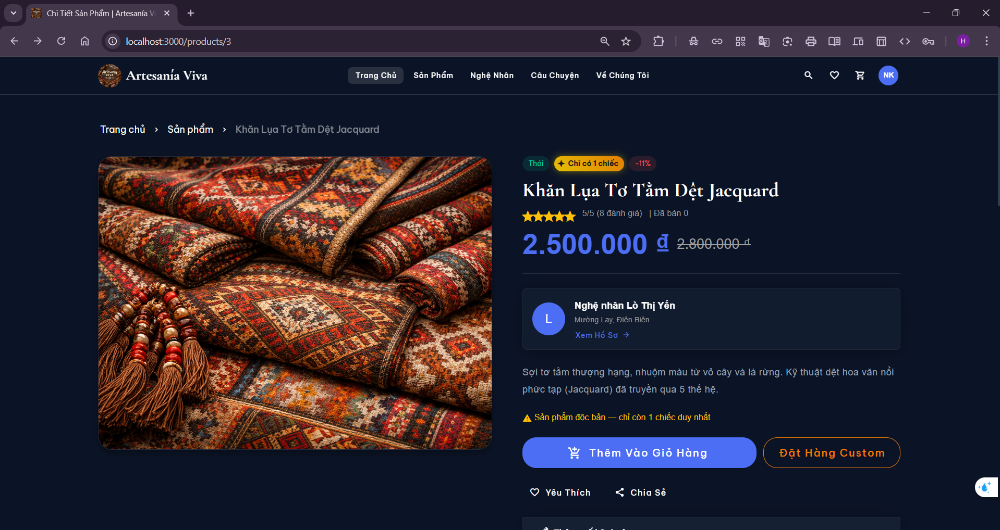 
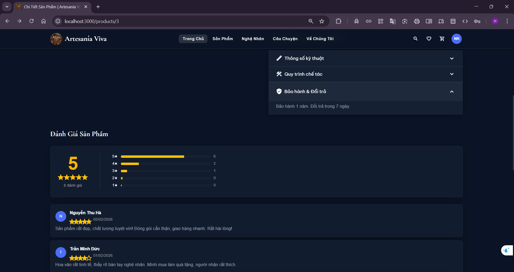 
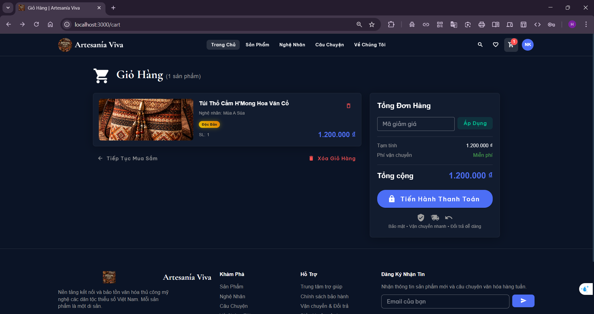 
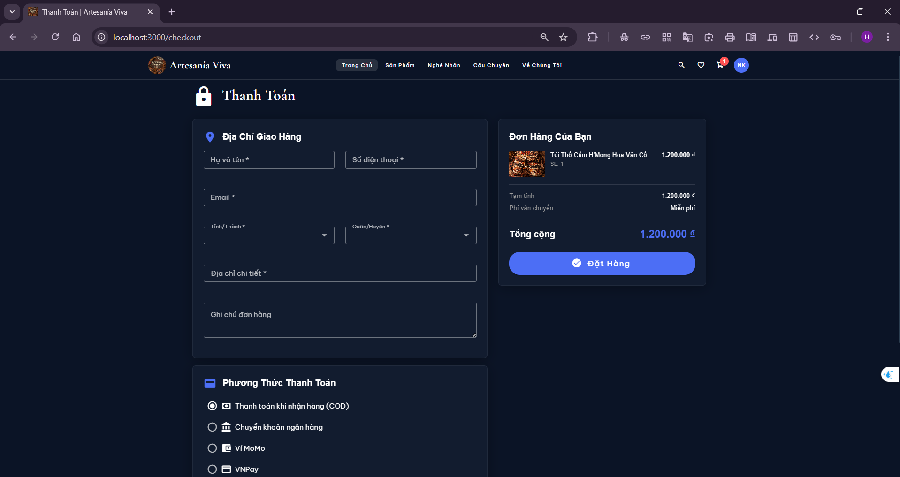 
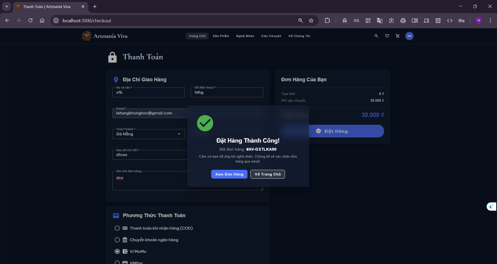 
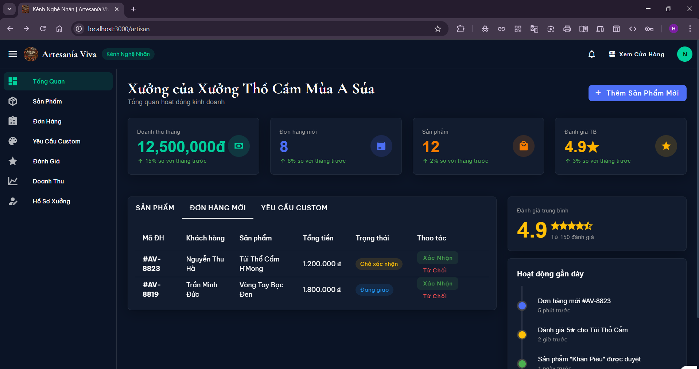
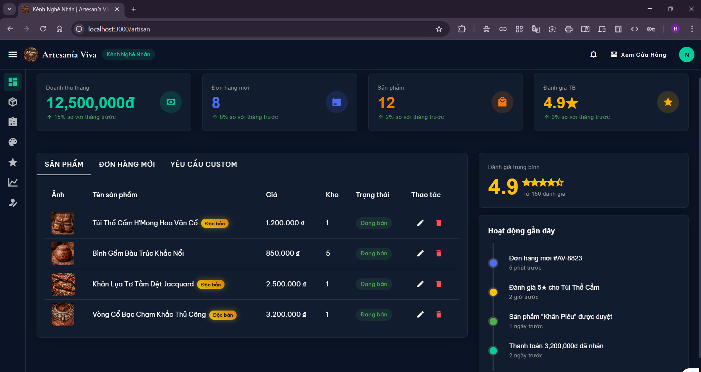
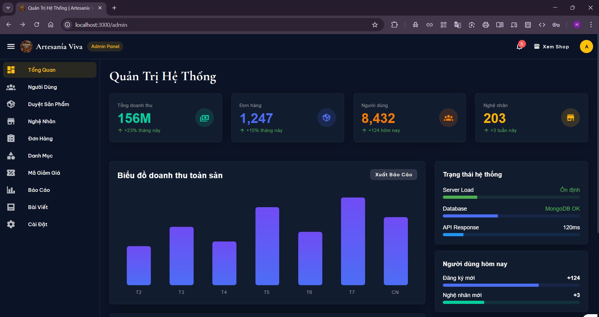
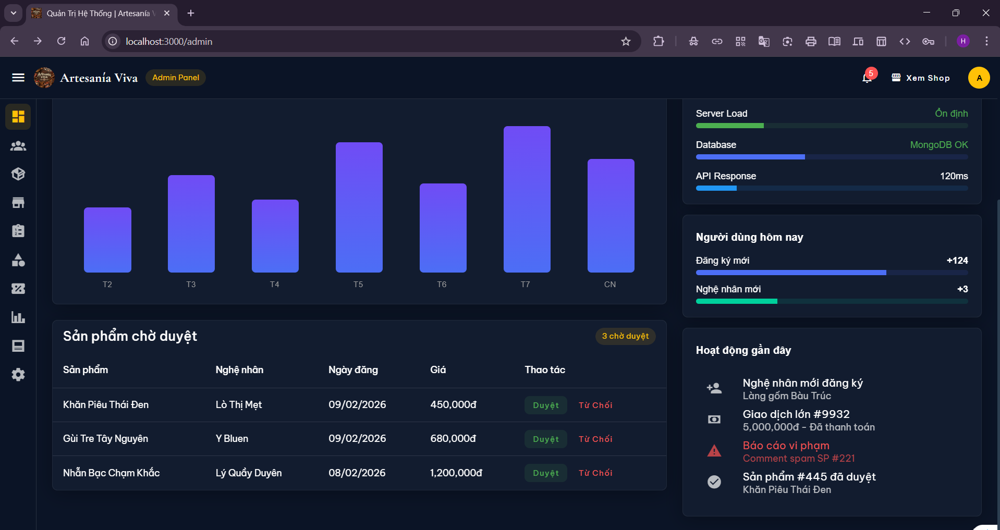

## 1. CẤU TRÚC BAN ĐẦU KHI MỞ BẰNG VSCODE

```
artesania-viva/
│
├── index.html
├── package.json
├── vite.config.js
├── public/
│   └── images/
│       ├── about-culture.jpg
│       ├── artisan-story.jpg
│       ├── category-baskets.jpg
│       ├── category-jewelry.jpg
│       ├── category-pottery.jpg
│       ├── category-textiles.jpg
│       ├── hero-banner.jpg
│       ├── logo.png
│       ├── product-sample-1.jpg
│       ├── product-sample-2.jpg
│       └── product-sample-3.jpg
└── src/
    ├── main.js
    ├── App.vue
    │
    ├── api/
    │   ├── index.js
    │   └── services.js
    │
    ├── assets/
    │   └── styles/
    │       └── global.scss
    │
    ├── components/
    │   ├── common/
    │   │   └── ProductCard.vue
    │   └── layout/
    │       ├── AppNavbar.vue
    │       └── AppFooter.vue
    │
    ├── plugins/
    │   └── vuetify.js
    │
    ├── router/
    │   └── index.js
    │
    ├── stores/
    │   ├── auth.js
    │   ├── cart.js
    │   ├── notification.js
    │   └── product.js
    │
    ├── utils/
    │   └── helpers.js
    │
    └── views/
        ├── NotFound.vue
        │
        ├── auth/
        │   ├── LoginPage.vue
        │   └── RegisterPage.vue
        │
        ├── customer/
        │   ├── CustomerLayout.vue
        │   ├── HomePage.vue
        │   ├── ProductsPage.vue
        │   ├── ProductDetailPage.vue
        │   ├── CartPage.vue
        │   ├── CheckoutPage.vue
        │   ├── ArtisansPage.vue
        │   ├── ArtisanProfilePage.vue
        │   ├── StoriesPage.vue
        │   ├── StoryDetailPage.vue
        │   ├── OrdersPage.vue
        │   ├── OrderDetailPage.vue
        │   ├── WishlistPage.vue
        │   ├── ProfilePage.vue
        │   └── AboutPage.vue
        │
        ├── artisan/
        │   ├── ArtisanLayout.vue
        │   ├── DashboardPage.vue
        │   ├── ProductsManagePage.vue
        │   ├── ProductFormPage.vue
        │   ├── OrdersManagePage.vue
        │   ├── CustomOrdersPage.vue
        │   ├── ReviewsPage.vue
        │   ├── RevenuePage.vue
        │   └── ProfilePage.vue
        │
        └── admin/
            ├── AdminLayout.vue
            ├── DashboardPage.vue
            ├── UsersPage.vue
            ├── ProductsPage.vue
            ├── ArtisansPage.vue
            ├── OrdersPage.vue
            ├── CategoriesPage.vue
            ├── CouponsPage.vue
            ├── ReportsPage.vue
            ├── BlogsPage.vue
            └── SettingsPage.vue
```
## 2. CÀI ĐẶT DATABASE (MongoDB)

```
# Windows (nếu không cài service):
mongod
```
MongoDB sẽ chạy mặc định tại `localhost:27017`.
Mở terminal mới, gõ:

```
mongosh
```
Trong shell MongoDB:

```
use artesania_viva
```
Không cần tạo collection trước. Spring Boot sẽ tự tạo collections khi chạy lần đầu.
### Cấu hình kết nối trong backend Spring Boot
Trong file `application.properties` hoặc `application.yml` của project backend:

```properties
spring.data.mongodb.uri=mongodb://localhost:27017/artesania_viva
spring.data.mongodb.database=artesania_viva
```
Hoặc YAML:

```yaml
spring:
  data:
    mongodb:
      uri: mongodb://localhost:27017/artesania_viva
      database: artesania_viva
```
### Kết nối frontend với backend
Frontend không kết nối trực tiếp với MongoDB. 
Frontend gọi API đến backend Spring Boot, backend xử lý và truy vấn MongoDB.
Luồng dữ liệu:

```
Browser (Vue) → http://localhost:3000/api/*
                        ↓ (Vite proxy)
              http://localhost:8080/api/*
                        ↓
              Spring Boot Controller
                        ↓
              Spring Data MongoDB
                        ↓
              MongoDB (localhost:27017)
```
File `vite.config.js` đã cấu hình proxy sẵn:

```javascript
server: {
  port: 3000,
  proxy: {
    '/api': {
      target: 'http://localhost:8080',
      changeOrigin: true
    }
  }
}
```
Mọi request từ frontend có đường dẫn bắt đầu bằng `/api` sẽ tự động chuyển tiếp đến `http://localhost:8080`.
## CÀI ĐẶT VÀ CHẠY FRONTEND
Mở Terminal trong VSCode :

```
npm install
```

### Sau khi chạy `npm install`, cấu trúc project thay đổi

Thư mục `node_modules/` và file `package-lock.json` được sinh ra:

```
artesania-viva/
│
├── index.html
├── package.json
├── package-lock.json   ← SINH MỚI
├── vite.config.js
│
├── node_modules/   ← SINH MỚI (thư mục chứa ~800 packages)
│   ├── vue/
│   ├── vuetify/
│   └── ... (hàng trăm thư mục con)
│
├── public/
│   └── images/
└── src/
```

### Chạy development server

```
npm run dev
```
Terminal sẽ hiện:

```
  VITE v5.x.x  ready in xxx ms

  ➜  Local:   http://localhost:3000/
  ➜  Network: http://192.168.x.x:3000/
```
Project có sẵn mock data. Nhấn nút **Demo** trên thanh navbar để đăng nhập thử với 3 vai trò: Khách Hàng, Nghệ Nhân, Quản Trị.
## FRONTEND TƯƠNG THÍCH VỚI BACKEND NHƯ THẾ NÀO
### Kiến trúc tổng thể

```
┌──────────────────────────┐     ┌──────────────────────────────┐     ┌─────────────┐
│   FRONTEND               │     │   BACKEND                    │     │  DATABASE   │
│   Vue 3 + Vuetify 3      │────▶│   Java + Spring Boot         │────▶│  MongoDB    │
│   Port 3000              │ API │   Port 8080                  │     │  Port 27017 │
│                          │     │                              │     │             │
│  src/api/services.js     │     │  @RestController             │     │  artesania  │
│  gọi đến /api/*          │     │  nhận request từ /api/*      │     │  _viva      │
└──────────────────────────┘     └──────────────────────────────┘     └─────────────┘
```
### File `src/api/index.js`
Tạo 1 instance Axios duy nhất với `baseURL: '/api'`. 
Mọi request đều đi qua đây. 
Interceptor tự động gắn JWT token vào header `Authorization: Bearer <token>` cho mỗi request. 
Interceptor response tự xử lý lỗi 401 (hết hạn token → redirect login), 403, 500.
### File `src/api/services.js`
File này chứa tất cả service functions tương ứng với các REST API mà backend cần cung cấp:

```
authService
  POST   /api/auth/login
  POST   /api/auth/register
  POST   /api/auth/logout
  GET    /api/auth/profile
  PUT    /api/auth/profile
  PUT    /api/auth/change-password
  POST   /api/auth/forgot-password
  POST   /api/auth/reset-password

productService
  GET    /api/products
  GET    /api/products/:id
  GET    /api/products/search
  GET    /api/products/category/:categoryId
  GET    /api/products/artisan/:artisanId
  GET    /api/products/featured
  GET    /api/products/new-arrivals
  POST   /api/products
  PUT    /api/products/:id
  DELETE /api/products/:id
  POST   /api/products/:id/images
  DELETE /api/products/:productId/images/:imageId

categoryService
  GET    /api/categories
  GET    /api/categories/:id
  POST   /api/categories
  PUT    /api/categories/:id
  DELETE /api/categories/:id

ethnicService
  GET    /api/ethnic-groups
  GET    /api/ethnic-groups/:id
  POST   /api/ethnic-groups
  PUT    /api/ethnic-groups/:id
  DELETE /api/ethnic-groups/:id

cartService
  GET    /api/cart
  POST   /api/cart/items
  PUT    /api/cart/items/:itemId
  DELETE /api/cart/items/:itemId
  DELETE /api/cart

orderService
  GET    /api/orders
  GET    /api/orders/:id
  POST   /api/orders
  PUT    /api/orders/:id/cancel
  PUT    /api/orders/:id/status
  GET    /api/orders/artisan
  PUT    /api/orders/:id/confirm
  PUT    /api/orders/:id/ship

reviewService
  GET    /api/reviews/product/:productId
  POST   /api/reviews
  PUT    /api/reviews/:id
  DELETE /api/reviews/:id
  GET    /api/reviews/artisan/:artisanId

artisanService
  GET    /api/artisans
  GET    /api/artisans/:id
  GET    /api/artisans/profile
  PUT    /api/artisans/profile
  GET    /api/artisans/dashboard
  GET    /api/artisans/revenue
  POST   /api/artisans/register

customOrderService
  GET    /api/custom-orders
  GET    /api/custom-orders/:id
  POST   /api/custom-orders
  PUT    /api/custom-orders/:id/respond
  PUT    /api/custom-orders/:id/accept
  PUT    /api/custom-orders/:id/reject

wishlistService
  GET    /api/wishlist
  POST   /api/wishlist
  DELETE /api/wishlist/:productId

paymentService
  POST   /api/payments
  GET    /api/payments/:paymentId
  PUT    /api/payments/:paymentId/confirm

shippingService
  POST   /api/shipping/calculate
  GET    /api/shipping/providers
  GET    /api/shipping/track/:trackingNumber

blogService
  GET    /api/blogs
  GET    /api/blogs/:id
  POST   /api/blogs
  PUT    /api/blogs/:id
  DELETE /api/blogs/:id

notificationService
  GET    /api/notifications
  PUT    /api/notifications/:id/read
  PUT    /api/notifications/read-all
  GET    /api/notifications/unread-count

adminService
  GET    /api/admin/dashboard
  GET    /api/admin/users
  PUT    /api/admin/users/:userId/status
  GET    /api/admin/products/pending
  PUT    /api/admin/products/:productId/approve
  PUT    /api/admin/products/:productId/reject
  GET    /api/admin/stats/revenue
  GET    /api/admin/stats/orders
  GET    /api/admin/reports
  PUT    /api/admin/reports/:reportId
  GET    /api/admin/artisans/pending
  PUT    /api/admin/artisans/:artisanId/approve
  PUT    /api/admin/artisans/:artisanId/reject

couponService
  POST   /api/coupons/validate
  GET    /api/coupons
  POST   /api/coupons
  PUT    /api/coupons/:id
  DELETE /api/coupons/:id

addressService
  GET    /api/addresses
  POST   /api/addresses
  PUT    /api/addresses/:id
  DELETE /api/addresses/:id
  PUT    /api/addresses/:id/default
```
### File `src/stores/product.js`
Chứa biến `useMock: true`. 
Khi backend chưa sẵn sàng, frontend dùng dữ liệu mock có sẵn. 
Khi backend đã chạy, đổi thành `useMock: false`, toàn bộ dữ liệu sẽ được lấy từ Spring Boot API.
### File `src/stores/auth.js`
Lưu JWT token vào localStorage. 
Mỗi request gửi đi sẽ kèm header `Authorization: Bearer <token>`. 
Backend cần trả về response dạng:

```json
{
  "token": "eyJhbGciOiJIUzI1NiJ9...",
  "user": {
    "id": "...",
    "fullName": "...",
    "email": "...",
    "role": "CUSTOMER | ARTISAN | ADMIN",
    "phone": "...",
    "avatar": "..."
  }
}
```
### File `src/router/index.js`
Route guard kiểm tra `requiresAuth` và `role` trước khi cho phép truy cập. 
Các route artisan yêu cầu role `ARTISAN`. 
Các route admin yêu cầu role `ADMIN`. 
Backend cần trả role trong user object để frontend phân quyền đúng.
### File `src/utils/helpers.js`
Chứa `ORDER_STATUSES` và `PAYMENT_METHODS`. 
Backend cần sử dụng đúng các giá trị status:

```
PENDING, CONFIRMED, PROCESSING, SHIPPING, DELIVERED, CANCELLED, RETURNED
```
Backend cần sử dụng đúng các giá trị payment method:

```
COD, BANK_TRANSFER, MOMO, VNPAY, ZALOPAY
```
### MongoDB collections tương ứng

Backend cần tạo các Document/Entity class ánh xạ tới các MongoDB collection sau:

```
users              → User.java
products           → Product.java
categories         → Category.java
ethnic_groups      → EthnicGroup.java
orders             → Order.java
order_items        → OrderItem.java (embedded trong Order)
reviews            → Review.java
carts              → Cart.java
wishlists          → Wishlist.java
custom_orders      → CustomOrder.java
coupons            → Coupon.java
blogs              → Blog.java
notifications      → Notification.java
addresses          → Address.java (embedded trong User hoặc riêng)
payments           → Payment.java
```
### Thứ tự chạy cả hệ thống

```
1.  Khởi động MongoDB              → mongod                       (port 27017)
2.  Khởi động Spring Boot backend  → mvn spring-boot:run          (port 8080)
3.  Khởi động Vue frontend         → npm run dev                  (port 3000)
4.  Mở trình duyệt                 → http://localhost:3000
```

Frontend gửi request đến `localhost:3000/api/*` 
→ Vite proxy chuyển tiếp đến `localhost:8080/api/*` 
→ Spring Boot xử lý và truy vấn MongoDB 
→ trả JSON response 
→ frontend render giao diện.

### Cấu trúc thư mục backend ( Tương lai ):

